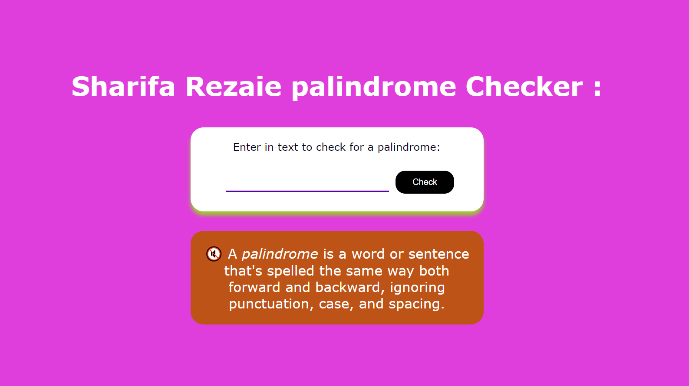

# palindrom-checker-project
Project Description 📝
Create palindrom-checker-project using HTML and CSS,script.js. Which have a header, image, article and a footer. Apply all the instruction of palindrom-checker-project on freecodecamp.org .

Demo 📸
life demo : 

here is a demo of palindrom-checker-project .

first page

Technologies Used 🛠️
List the technologies or tools that i used to develop this project.
script.js
HTML
CSS
Installation 💻
for using this project you neet to install 3 things:

chrombrowser
an IDE like vscode
git
Usage 🎯
for using this project you need to know a few commond first clone the repositry in yor local machine then go to the github directory . open the project on your IDE like vscode and start working on it .

go to the cmd and clone the palindrom-checker-project using this commond:

git clone https://github.com/Sharifarezaie/palindrom-checker-project
go to the githu directory:

cd>tribute-page
open the project on your IDE like vscode :

cd>palindrom-checker-project> code .
Features ⭐
Responsive webpage
sharifaRezaie👩‍💻
LinkedIn: [(https://www.linkedin.com/in/sharifa-rezaie-646636309/)]
Email: [(sharifashaida82@gamil.com)]
Contributing 🤝
For contribution you can create a pull request and mention me there.Thank you. 